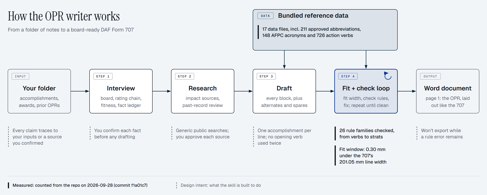

# ussf-opr-agent

This skill (a Claude Code plugin that also works in Google Antigravity) writes a complete **DAF Form 707 Officer Performance Report** (Lt thru Col, USSF or USAF) from a folder of your own material. It works for any officer: it knows nothing about you until you point it at your folder.



- **Reads** the guidance, prior OPRs and accomplishment notes in your folder, and builds a **fact ledger** for you to confirm.
- **Researches** public, sourced context for joint and warfighter impacts: exercise scale, users served, CSO C-Notes, doctrine.
- **Drafts** the Job Description, Rater, Additional Rater and Reviewer blocks in OPR bullet language (`Action; Result--Impact`), with strat and push lines. When the ratee writes the draft, the stratifications become placeholders for the rater to fill in.
- **Fits** every line flush to the form's right edge. Lines are Times New Roman 12 pt and 201.05 mm wide, with thin and thick spaces doing the final adjustment, as bullet-buddy does.
- **Lints** each line against the command writing guide:
  - approved acronyms, checked per meaning;
  - approved abbreviations, written exactly as listed and used consistently;
  - stratification rules and prohibited content;
  - no repeated numbers (dollars, percents and counts compared separately), opening verbs, accomplishments or buzzwords;
  - precise numbers over round ones, and readable lines (no more than half acronyms/abbreviations);
  - no acronyms stacked on consecutive lines;
  - every alternate and spare bullet audited against the whole OPR before you see it.
- **Writes for your board.** It works out your competitive category from your grade and core specialty: USSF LSF, LSF-O or LSF-F, or USAF LAF-x. Jargon from your own field stays; experience from other career fields is rewritten in plain language.
- **Scores your record** the way the board's Career Review worksheet does: stratifications, DE pushes and command pushes across all your OPRs. It flags weak or inconsistent strats. It checks duty-title progression against your AMS SURF, shows your SCOD, and gives career-field and education guidance. Strats are placeholders until your rater provides them, and a bottom-half strat is never included unless a strong secondary strat requires its primary.
- **Exports** a DOCX that mirrors the 707, ready to paste into myEval or the PDF, with an appendix of notes for the rating chain.

## Install
```
/plugin marketplace add <github-user>/ussf-opr-agent      # or a local path to this repo
/plugin install ussf-opr-agent@ussf-opr-agent
```
You also need:
- **Python 3.10+.** The skill offers to run `pip install -r skills/opr-writer/scripts/requirements.txt`.
- **Times New Roman.** It ships with Windows and macOS. On Linux, install `fonts-liberation` or point `OPR_FONT` at the font file.

### Google Antigravity (IDE or CLI), or a personal Claude Code skill
The skill is plain `SKILL.md`, Python and JSON, so Antigravity runs it as-is. Clone this repository, then install a **copy** of the skill:
```
python install.py install agy          # Antigravity 2.0 / IDE (offers ~/.gemini/config/skills -> ~/.agents/skills)
python install.py install agents       # the shared ~/.agents/skills folder
python install.py install agy-cli      # Antigravity CLI (global)
python install.py install workspace --workspace "C:/path/to/My 2026 OPR"   # this workspace only (.agents/skills)
python install.py install claude       # Claude Code personal skill (the alternative to the plugin)
python install.py update               # after every `git pull`: re-copy into every existing install
python install.py uninstall agy
```
- **The skill folder is always a real directory.** Antigravity (like some other harnesses) won't load a skill whose root folder is a symlink or junction. Only a *parent* skills folder may be linked.
- Recommended layout: `~/.agents/skills/opr-writer` is the real copy, and `~/.gemini/config/skills` is linked to `~/.agents/skills`, so one copy serves both. `install agy` offers to create that parent link (a junction on Windows, no admin rights) and skips it if it already exists.
- A copy doesn't follow repo edits, so run `update` after pulling. `update` also replaces any old link left at the skill root by earlier versions of this installer.
- Reload Antigravity, then type `/opr-writer`, or just ask it to write your OPR.
- In Antigravity, the tool uses `invoke_subagent` with `skills/opr-writer/reference/tq-researcher-prompt.md` for deep Tongue and Quill lookups, in place of the Claude Code plugin agent.

## Use
Put your material in one folder. Any layout works, but this one is typical:
```
My 2026 OPR/
  Guidance/   writing guide(s), acronym/abbreviation lists, the 707 (a "print to PDF" copy helps), verb lists
  Data/       prior OPR bullets, award write-ups, accomplishment notes
```
Then, in Claude Code, run:
```
/opr-writer "C:\path\to\My 2026 OPR"
```
Everything the tool produces stays in your folder:
- `Output/<Name> OPR <period>.docx` is the deliverable. Page 1 pastes 1:1 into myEval or the PDF; page 2 holds rater notes, alternates and 4 spare bullets. If you opt in (you'll be asked), the fact ledger, research report and record review are exported next to it as DOCX.
- `_opr_work/` holds working files. `draft.json` is engine state that lets a later session resume. **Don't hand-edit it**; that breaks the line fitting.

The engine has one entry point: `scripts/opr.py build | check | fit | lint <draft.json>` (plus `opr.py measure "<line>"`).

## Defaults and overrides
| Topic | Default | Override |
|---|---|---|
| Approved acronyms/abbreviations | Lists built from CFC writing guidance (Writing Guide Attachments, 26 Jun 2026); the guide itself is not included | Put your command's list in `Guidance/`. The skill rebuilds it into `_opr_work/approved/`. |
| AFPC acronyms | AFPC list, 28 Oct 24 update, plus its approved categories (bundled) | Save a newer export of afpc.af.mil/Career-Management/Acronyms into `Guidance/` |
| CSO C-Notes and speeches | Digest of Gen Saltzman's Selected Works (Nov 2022 – Aug 2026): all 42 C-Notes, speeches and articles as key themes and short verbatim quotes | `build_cso_index.py <newer compilation.pdf> --out <local folder>` lists what the digest is missing |
| Unit-dependent policies (e.g. degree completion) | warn | `draft.settings.policies` (`allow` / `warn` / `forbid`) |
| Writing-guide body rules | Paraphrased from SpOC Writing Guide Ch 1, Sep 2023 (guide not included) | Add your command's current guide |
| Form | DAF 707 (20240213), 201.05 mm lines | `_opr_work/form.json`, for a new revision, EPRs, or awards |
| Tongue and Quill | Digest of the OPR-relevant rules (ch 8, 19, 25–28) of AFH 33-337, 27 May 2015 w/ Change 1; the full text isn't bundled, to keep token costs low | Supply a newer PDF. The skill indexes it locally and checks the digest against it. |
| Space mode | adjusted (flush right) | `normal`, for reviewers who reject special spaces |
| Fitness scores | `FITNESS SCORE:` line in Box I (official placement not yet published) | `ratee.fitness_placement`: `box1`, `remarks`, `both`, `none` |
| Standout buzzwords (once per OPR) | `reference/data/buzzwords.json` | `_opr_work/buzzwords.json` |

## Keeping it current
Forms, approved acronym lists, competitive categories, Space Force structure, and what promotion boards value all change, including when SECWAR, SECAF, CSO or administration priorities shift. For example, fitness scores became a heavily weighted board data point in 2026.

- `skills/opr-writer/reference/data/currency.json` records each dataset's published date, the date it was last verified, its source, and how to refresh it.
- `scripts/data_check.py` flags anything overdue.
- Current board emphasis lives in `board_priorities.json`.
- Anyone can override a dataset for their own situation in their `_opr_work/` folder, without touching the plugin.

## Privacy and CUI
A filled-out OPR is **CUI**. Keep your folder on an appropriate system, and follow your organization's rules for AI tools. The tool:
- never stores an SSN;
- never puts names or non-public details into web searches.

This repository contains no personal data.

## Maintainer notes
- Rebuild the bundled data after a guide changes:
  - `build_approved_lists.py <attachments.pdf>`
  - `build_lexicons.py --glossary-xlsx ... --verbs-xlsx ...`
  - `build_tq_index.py <afh33-337.pdf> --out <local folder>`, then update `tongue-and-quill-digest.md`
  - `build_cso_index.py <CSO selected works.pdf> --out <local folder>`, then add entries to `data/cso_digest.json`
  - Full-text indexes stay outside the repo; the skill ships digests only.
- Run the tests with `python -m unittest discover skills/opr-writer/scripts/tests`. To calibrate against a real OPR, set `OPR_CALIBRATION_FILE` to a text file of fitted lines.
- The width-fitting technique is credited to [AF-Tools/bullet-buddy](https://github.com/AF-Tools/bullet-buddy) (MIT).
